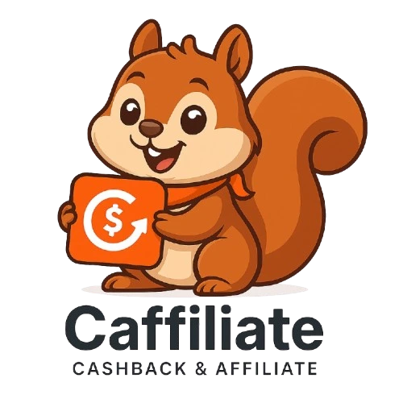

  

  <h1>「 Z O L T R A A K 」</h1>

⚡ ZOLTRAAK!!!!!!!!!! ⚡

 

  <h2>Hi, I'm Kha Dang 👋</h2>

  

    IT Engineer · Building things for work, curiosity, and sometimes just because I can.
  

  

    ⚡ Pokémon &nbsp;·&nbsp;
    🤖 Doraemon &nbsp;·&nbsp;
    🏴‍☠️ One Piece
  

   

  <h2>Side Quests</h2>

  

    Small things I build, maintain, and occasionally overthink.
  

  <table>
    <tr>
      <td align="center" width="280">
        
          
        <strong>Caffi</strong>
         
        Cashback & Affiliate Platform
          
        8,500+ users
      </td>
      <td align="center" width="280">
        
          
        <strong>MezaDex</strong>
         
        Pokémon Mezastar Companion
          
        6,500+ users
      </td>
    </tr>
  </table>

   

  <h2>Currently</h2>

  

    Working with infrastructure, backend systems, AI agents, and whatever looks interesting enough to build.
  

   

  <h3>Professional Work</h3>

  

    What I do when I'm not on a side quest.
  

  <a href="https://khadang.cv">
    <strong>khadang.cv</strong>
  </a>

